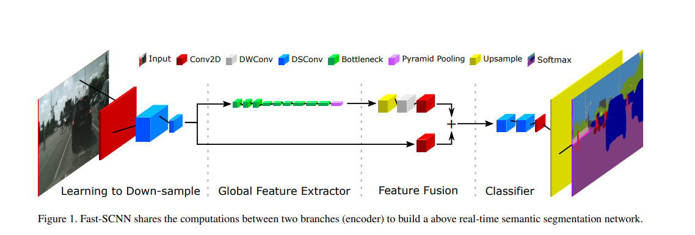
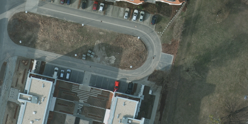

# fast_scnn
**This model used as part of [The Oracle](https://youtu.be/BMZZG9P4NsU?t=4426) project**

  

Fast SCNN implementation on Potsdam and UDD dataset.  
Simple implementation for custom dataset training.  
paper: https://arxiv.org/abs/1902.04502  
dataset: http://www2.isprs.org/commissions/comm3/wg4/2d-sem-label-potsdam.html  
https://github.com/MarcWong/UDD  
model borrowed from: https://github.com/Tramac/Fast-SCNN-pytorch  
  
## Potsdam example

|Image | gt | result |
|------| -- |--------|
|   | |   |
  
## Airsim  

|Image | result |
|----- |--------|
|  |  |
