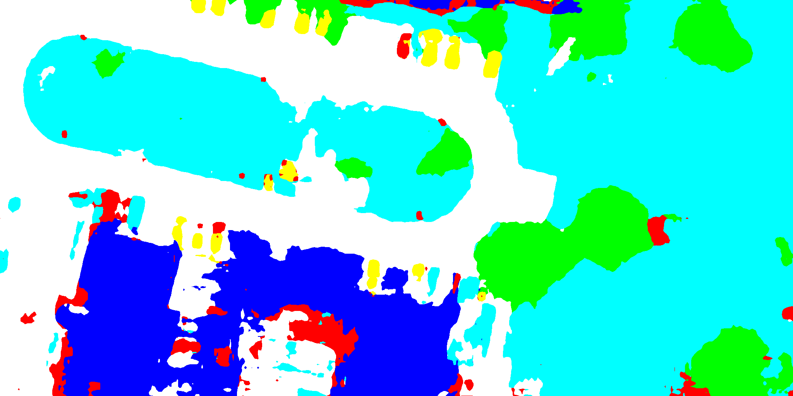

# fast_scnn

  

Fast SCNN implementation on Potsdam and UDD dataset  
paper: https://arxiv.org/abs/1902.04502  
dataset: http://www2.isprs.org/commissions/comm3/wg4/2d-sem-label-potsdam.html  
https://github.com/MarcWong/UDD  
model borrowed from: https://github.com/Tramac/Fast-SCNN-pytorch  

## potsdam example

   

|Image | gt | result |
|----| ---- |----|
|  | |   |
| s| ss | asd |
